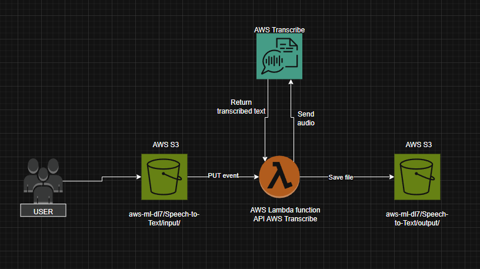

# AWS-Speech-to-Text

**Technical problems solved** – storing and managing audio recordings and transcripts securely and cost-effectively using Amazon S3, converting audio to text with Amazon Transcribe, and automating the transcription process with AWS Lambda.

---

## 📊 Diagram Architecture

---

## 1. IAM Role Configuration

To run the script, create a role using Identity and Access Management (IAM).

### Steps:
1. Go to the **IAM console**.
2. Create a new role, e.g., `lambda-transcribe-s3-access`.
3. Attach the following policies:
   - `AmazonTranscribeFullAccess`
   - `AmazonS3FullAccess`
   - `AWSLambda_FullAccess`

---

## 2. S3 Bucket Setup

Create a new S3 bucket with a globally unique name.

### 📁 Folder Structure:
- Speech-to-Text/input/
- Speech-to-Text/output/
---

## 3. Lambda Function Setup

1. Go to the **Lambda** service in the AWS Console.
2. Click **Create function**.
3. **Runtime**: Python 3.12  
4. **Permissions**: Use an existing role — select the `lambda-transcribe-s3-access`.

### 🧾 Code Deployment:
- In the **Code Source** section, paste the contents of your `lambda_function.py`.

### 🔧 Runtime Settings:
1. Scroll down to **Runtime settings**
2. Click **Edit**
3. Set **Handler** to:  
4. Click **Save**

### 📥 Add S3 Trigger:
1. At the top of the Lambda function page, click **+ Add trigger**.
2. Choose **S3** as the source.
3. Select your bucket.
4. Set:
- **Prefix**: `Speech-to-Text/input/`
- **Suffix**: `.mp3`
- **Event Types**: All object create events
5. Save the trigger.

✅ Done!